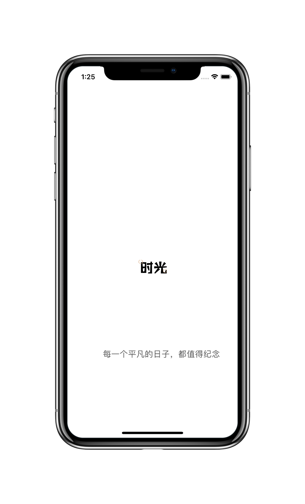
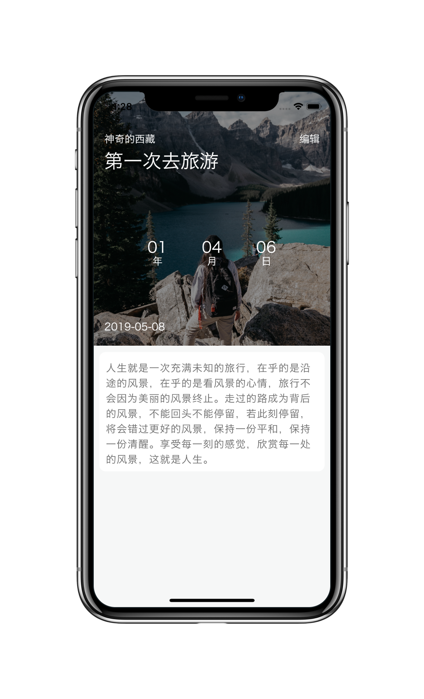
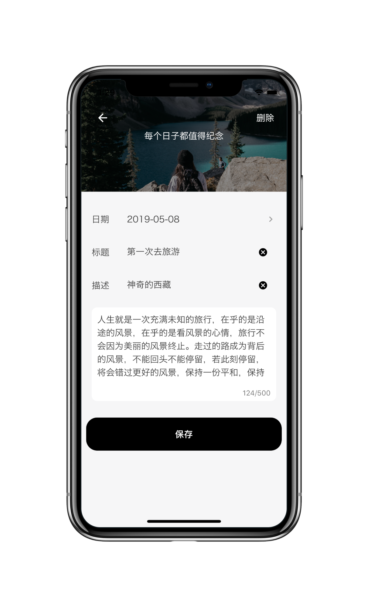
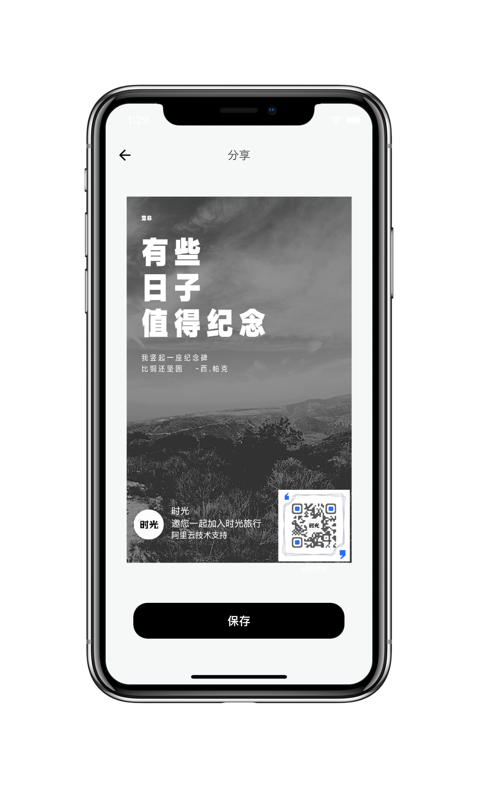
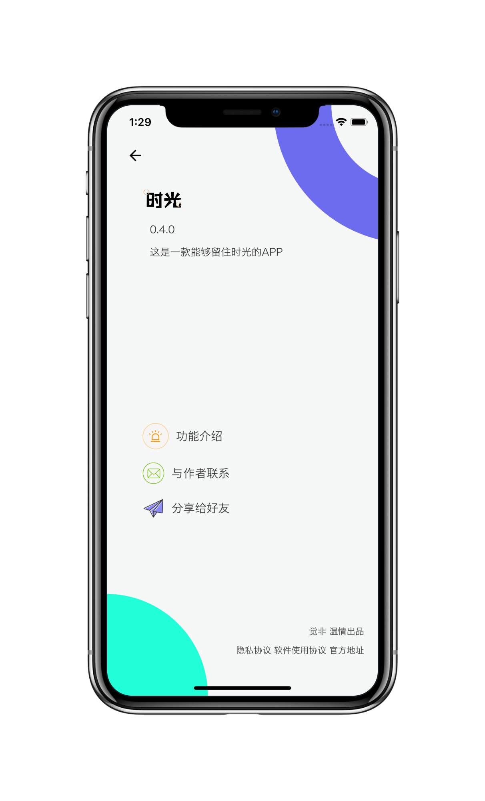

# Time · 时光

> **完全离线**的纪念日 App。记录每一个值得记住的日子。

[](https://flutter.dev)
[](https://dart.dev)
[](https://developer.android.com)
[](./LICENSE)

没有账号，没有云同步，没有埋点，**没有任何网络请求** —— APK 里连 `INTERNET` 权限都不申请。所有数据只存在你自己的手机上。

---

## 功能

| | |
| --- | --- |
| **纪念日列表** | 自动分「未来 / 已过去」两组，组内按离今天由近到远排序。每张卡片直接显示「还有 N 天」或「已经 N 天」 |
| **计数详情** | 点按在「年月日」与「总天数」之间切换 |
| **重复纪念日** | 每年 / 每月重复。重复的记录有两个视角：它是多久以前开始的（年龄），以及距离下一次还有多久 —— 点一下就能换过来 |
| **提醒通知** | 「提前 N 天 + 具体时刻」。到点弹通知，重启手机后也会自动重新排上 |
| **时光轴** | 一条横向的轴，今天固定在屏幕正中。跨度几十年的记录用对数刻度压缩，远的不会挤成一团 |
| **封面** | 6 套内置渐变（恋爱 / 家人 / 朋友 / 工作 / 学习 / 生日），也可以从相册选一张自己的照片；照片点开全屏可缩放 |
| **分享海报** | 满幅照片 + 标题 + 日期 + 天数，输出 **1080×1920** PNG，可存相册或拉起系统分享面板 |
| **备份与恢复** | 导出一个 zip（记录 + 全部照片），换手机时导回去。导入是**覆盖**式，动手前会先问清楚 |
| **亮 / 暗主题** | 手动切换，选择记在本地。不跟随系统 —— 这是一个「我会替你记住」的开关，不是系统设置的镜像 |
| **隐私锁** | 进 App 前先过系统验证。**是遮罩，不是加密**，边界见下 |
| **完全离线** | 数据存在本地 SQLite，照片存在应用私有目录，不联网也能用一辈子 |

## 截图

> [!NOTE]
> 下面这组截图拍摄于 **2020 年的原始版本**。1.1.0 在保留原设计骨架（弧线、字体、配色）的前提下重做了交互与层级，实际界面与截图已有出入 —— 但为了留下「它从哪儿来」的记录，这里没有换掉。


|  |  |  |
| :--------------------------------: | :--------------------------------: | :--------------------------------: |
|  |  |  |

---

## 提醒与权限

提醒功能是本项目唯一一处「必须向系统要权限」的地方，所以权限面从 1 条涨到 6 条。逐条列出来：

| 权限 | 为什么需要 |
| --- | --- |
| `WRITE_EXTERNAL_STORAGE`<br>`maxSdkVersion=29` | 把分享海报写进相册。Android 11+ 走 MediaStore，不需要这条 |
| `POST_NOTIFICATIONS` | Android 13+ 发通知必须申请 |
| `SCHEDULE_EXACT_ALARM` | 你要的是「准时到分钟」，那就得用精确闹钟 |
| `RECEIVE_BOOT_COMPLETED` | 重启会清空系统闹钟表，靠这条把提醒重新排上 |
| `VIBRATE` | 通知震动 |
| `USE_BIOMETRIC` | 隐私锁问一句「这人是不是机主」。指纹/人脸数据不出安全芯片，App 拿不到 |

**没有 `INTERNET`。** 这是这个项目唯一一个从 2020 年保留至今、并且以后也不打算让掉的承诺：本地通知不需要网络，导出的备份也不需要网络。

`aapt2 dump badging` 打出来还会多三条，都不是手写的，是依赖库的 manifest 合并进来的，一并说明白：

| 合并进来的权限 | 来源 |
| --- | --- |
| `READ_EXTERNAL_STORAGE`<br>`maxSdkVersion=29` | `image_picker` / `file_picker` 在 Android 10 及以下读你选的那张照片 |
| `USE_FINGERPRINT` | `local_auth` 的旧声明，已被 `USE_BIOMETRIC` 取代，仅为向后兼容保留 |
| `DYNAMIC_RECEIVER_NOT_EXPORTED_PERMISSION` | AndroidX 自动加的**签名级**权限，用来把动态注册的广播接收器锁在应用内，是收紧而不是放宽 |

两条会降级、不装死的路径：

- **拒绝通知权限**：功能不崩、不反复弹窗，设置里如实说明提醒不会响。
- **精确闹钟被系统收回**（Android 12+ 可能发生）：自动降级为非精确闹钟，并在设置里写清楚「可能会晚几分钟」。

## 隐私锁的边界

说清楚它是什么、不是什么：

- **它能挡住**：别人拿起你解锁着的手机、随手翻到你的纪念日。
- **它挡不住**：能解锁你手机并连上电脑的人。数据库和照片都是**明文**，`adb pull` 一样读得到。

所以它叫「遮罩锁」不叫「加密」。README 里这么写，App 的设置项里也这么写 —— 两处说法不一致就等于虚假宣传。

## 备份格式

导出的 `time-backup-<日期>-<时间>.zip`：

```
time-backup-20260911-1430.zip
├── manifest.json      { schema: 1, app: 'Time', version: '1.1.0', exportedAt, count }
└── covers/
    └── c_1757123456789_4f2a.jpg   ← 文件名原样保留，记录里的封面字段能直接对上
```

记录本体放在 `manifest.json` 里，字段名与数据库列名逐字一致。导入时先校验 `schema` —— **不认识就拒绝，不猜**。整个导入过程先解压到临时目录，校验通过才替换，所以不会出现「清空了但没导进来」。

---

## 这一版修掉了什么（2020 → 1.1.0）

这个项目最初完成于 2020 年 8 月，用 18 天写成。原版依赖一个自建的 mock 接口和一批 CDN 图片，两者现在都已失效，导致官方 APK 打开后永久卡在加载动画上。这一版做了完整重做：

| 症状 | 原因与处理 |
| --- | --- |
| **首页永久转圈** | 原版启动就去请求那个已经死掉的接口，异常逃出加载函数后 `loading` 永远停在 `true`。现在数据源只有本地 SQLite，没有任何网络调用 |
| **年月日算错** | 原版用 `total ~/ 365` + `(total - year*365) ~/ 30` 近似计算。2019-05-08 → 2020-09-10 会显示 `01年04月06天`，**正确答案是 `01年04月02天`**。已重写为「最大整数月 + 余数天」算法，见 `lib/utils/date_util.dart` |
| **照片过几天变空白** | 原版把 `image_picker` 返回的**临时缓存路径**直接存进数据库，系统清缓存后文件就没了。现在照片会复制进应用文档目录 `covers/`，数据库只存相对文件名 |
| **详情页点哪都退出** | 外层那个全屏 `GestureDetector(onTap: pop)` 已删除，换成左上角返回按钮 —— 否则「点按切换计数」根本点不到 |
| **编辑 / 删除静默失效** | 原版 `update` 用 `ConflictAlgorithm.replace` 且从不检查影响行数。现在 insert / update 分开，并断言恰好影响 1 行 |
| **空数据库出现幽灵卡片** | 原版在 `build()` 里 `setState` 造了一张 `id: 0` 的「欢迎」卡片，每次重建都重造一张。已删除 |
| **Hero 动画偶发崩溃** | 原版保存后用 `pushAndRemoveUntil` 重建整个路由栈，Hero 飞行途中同名 tag 会同时存在两个 |
| **依赖装不上** | 原版用 `unicorndial` 等包在 Dart 3 下无法解析；已迁移到 Dart 3 / Flutter 3.44 并重建 Android 工程 |

1.1.0 之前还有一类不算「bug」但影响长期使用的问题：数据只活在这一台手机上。所以这一版补上了提醒、重复规则和备份 —— 一个纪念日 App 如果不会提醒你、换机就全没了，它只是个能用的工具。

## 数据与迁移

```
数据库   <应用私有目录>/databases/db.daily     表 daily_cache，version 4（12 列）
照片     <应用私有目录>/covers/c_<时间戳>_<随机>.jpg
设置     <应用文档目录>/settings.json
```

升级路径是**逐级**的，任意老版本都能爬上来：

| 版本 | 加了什么 |
| --- | --- |
| v1 → v2 | `coverKey` 列，让老记录有封面可读 |
| v2 → v3 | `repeatRule` 列（none / yearly / monthly） |
| v3 → v4 | 提醒四件套：`remindEnabled` / `remindDaysBefore` / `remindHour` / `remindMinute` |

冷启动时会自动清理 `covers/` 里**无人引用且超过 24 小时**的孤儿文件。

> [!IMPORTANT]
> **2020 年那版里的照片无法恢复。**
> 原版把照片路径存在 `image_picker` 的临时缓存目录里，那些文件早已被系统清除。
> 迁移只保证老记录不崩溃、并保留原 `imageUrl` 列一字不改，读不到照片时显示渐变封面 ——
> 本项目**不做「恢复历史照片」的承诺**。

## 海报二维码

分享海报右下角的二维码指向 `lib/constants.dart` 里的 `kPosterShareUrl`，默认就是本仓库地址。留空则海报上不画二维码，排版会自动占满，不会留空洞。

```dart
const String kRepoUrl = 'https://github.com/Muanyan-mjq/Time';
const String kPosterShareUrl = kRepoUrl;
```

## 构建

环境：Flutter 3.44+ / Dart 3.12+ / JDK 17+ / Android SDK 36

```bash
flutter pub get
flutter analyze
flutter test        # 日期算法 / 重复规则 / 分组排序 / 封面解析 / 时光轴刻度 / 海报 / 日历导出 / 数据库迁移，135 个用例
flutter build apk --release
```

产物：`build/app/outputs/flutter-apk/app-release.apk`

想要更小的包（通用包 61 MB，三个 ABI 打在一起）：

```bash
flutter build apk --release --split-per-abi   # arm64-v8a 大约 22 MB
```

## 技术栈

Flutter · Dart 3 · sqflite · image_picker · share_plus · gal · qr_flutter · oktoast · url_launcher · flutter_local_notifications · timezone · archive · file_picker · lottie · local_auth

启动动画是**自绘的 Lottie JSON**（`assets/lottie/splash.json`），不引第三方素材 —— 这个仓库是公开的，LottieFiles 上的免费素材各有授权与署名要求，自绘几 KB 就能贴合品牌，也没有任何授权负担。想换的话把文件丢进同一路径即可。

## 项目结构

```
lib/
├── app.dart, main.dart          应用入口、主题、生命周期（跨零点自刷新 / 上锁 / 重排提醒）
├── constants.dart               应用名、仓库地址、海报二维码地址
├── utils/
│   ├── date_util.dart           日期算法（唯一的真值来源）
│   ├── haptics.dart             触感反馈
│   └── transitions.dart         统一转场曲线与错落入场
├── model/                       Daily / Cover / RepeatRule / 分组排序
├── data/                        数据库、Repository、照片存储、设置、
│                                通知调度、备份、日历导出、快捷方式、表单模板
├── components/                  卡片、封面选择器、按钮、对话框、空态
├── pages/                       首页 / 详情 / 表单 / 海报 / 关于 / 时光轴 / 全屏看图 / 启动 / 锁屏
└── styles/                      调色板、字体样式、尺寸 token、图标字体
```

## License

[MIT](./LICENSE)
